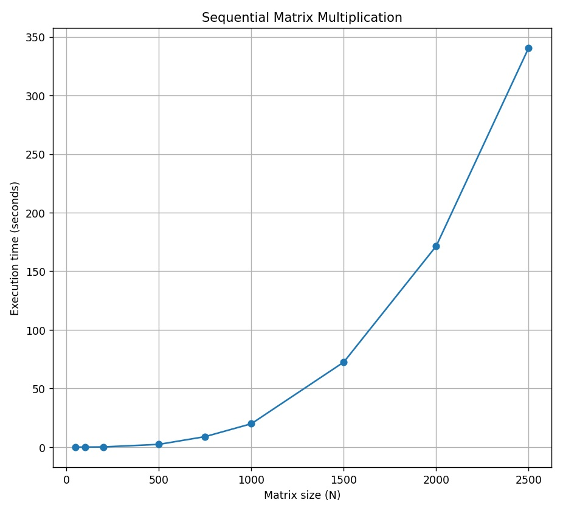

# Отчет по курсу  
## «Параллельное программирование»  
### Лабораторная работа №1

**Выполнил студент группы:**  
6212-100503D  
Зарипов Дамир Радикович  

**Преподаватель:**  
Минаев Евгений Юрьевич    

---

## Задание

Написать программу на языке **C/C++** для перемножения двух квадратных матриц.

**Исходные данные:**  
Файл(ы), содержащие значения исходных матриц.

**Выходные данные:**  
- файл со значениями результирующей матрицы  
- время выполнения  
- объем задачи  

Обязательна автоматизированная **верификация результатов вычислений** с помощью сторонних библиотек или стороннего ПО (например **Matlab/Python**).

---

## Краткое описание решения задачи

В работе реализована программа для **последовательного умножения квадратных матриц** с использованием тройного цикла, что обеспечивает асимптотическую сложность **O(N³)**.

Матрицы генерируются и считываются из файлов:

- `matrixA.txt`
- `matrixB.txt`

Результат записывается в файл **`output.txt`** вместе с:

- размером матрицы
- временем выполнения
- объёмом вычислений **2N³**

Измерение времени производится с помощью библиотеки **`std::chrono`**, что позволяет получить точные значения времени исполнения.

Корректность вычислений автоматически проверяется на **Python** с помощью сравнения результата вычислений с эталонным перемножением.

Экспериментальные результаты подтверждают **кубический рост времени выполнения**, при больших размерах матриц наблюдается небольшое несоответствие теории из-за неидеальных условий выполнения программы.

---

## Результаты экспериментов

Путем нескольких запусков были получены следующие данные и на их основе сформирован **график зависимости времени от размера матриц**.

| Размер квадратных матриц | Время вычисления (сек) |
|---|---|
| 50 | 0.0024418 |
| 100 | 0.0188559 |
| 200 | 0.143134 |
| 500 | 2.31492 |
| 750 | 8.926482 |
| 1000 | 19.9071 |
| 1500 | 72.492345 |
| 2000 | 171.491053 |
| 2500 | 340.58692 |

## График зависимости времени от размера матриц

---

## Вывод

В ходе экспериментов получена зависимость времени выполнения от размера матрицы, близкая к **кубической**. Это подтверждает теоретическую сложность алгоритма **O(N³)**.

Таким образом, экспериментальные результаты согласуются с теоретическими оценками сложности **последовательного алгоритма умножения матриц**.
