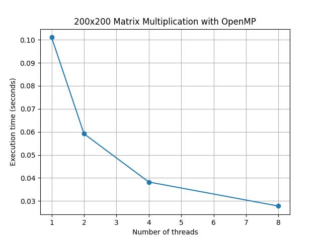
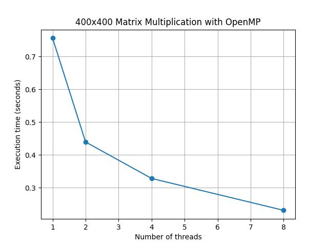
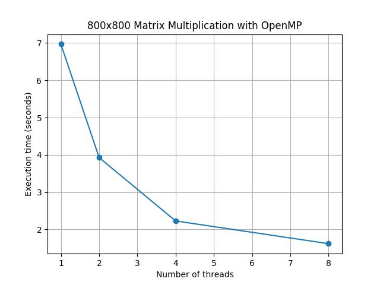
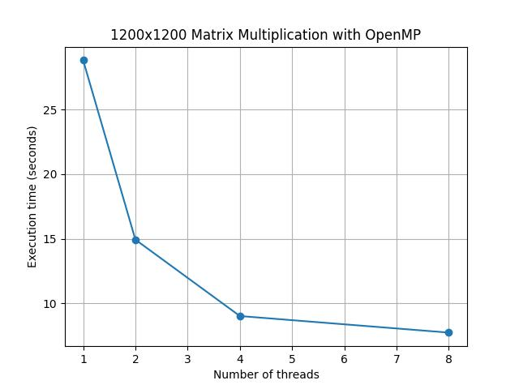
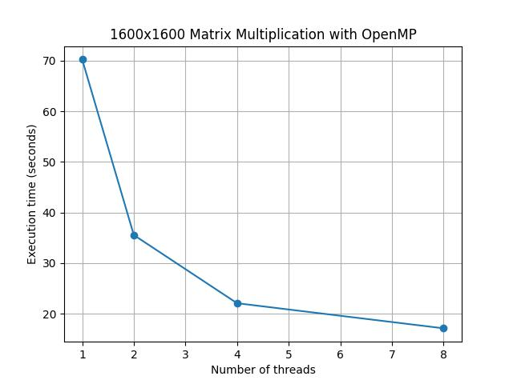
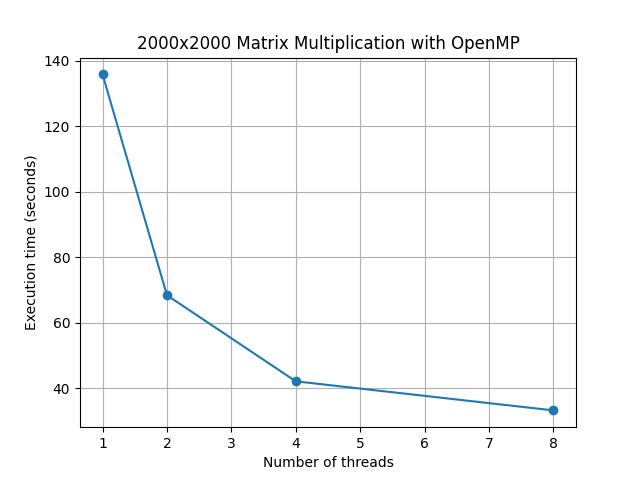

# Отчет по курсу  
## «Параллельное программирование»  
### Лабораторная работа №2

**Выполнил студент группы:**  
6212-100503D  
Зарипов Дамир Радикович  

**Преподаватель:**  
Минаев Евгений Юрьевич    

---

## Задание

Модифицировать программу из л/р №1 для параллельной работы по технологии **OpenMP**.  
Провести серию экспериментов с разным количеством потоков (1, 2, 4, 8 и т.д.), разными размерами матриц (примерно 200, 400, 800, 1200, 1600, 2000), с разным количеством вычислительных ядер при наличии технической возможности (1, 2, 4, 8 и т.д. ), иначе использовать фиксированное существующее количество вычислительных ядер, например 4.

---

## Краткое описание решения задачи

В работе реализована программа для **параллельного умножения квадратных матриц** с использованием технологии **OpenMP**. Алгоритм основан на стандартном тройном цикле умножения матриц, имеющем асимптотическую сложность **O(N³)**.

Параллелизация вычислений реализована с помощью директивы:

`#pragma omp parallel for collapse(2)`

что позволяет распределить вычисление элементов результирующей матрицы между несколькими потоками.

Матрицы генерируются и считываются из файлов:

- `matrixA.txt`
- `matrixB.txt`

Результаты работы программы записываются в файлы:

- `plot.txt` — данные для построения графиков
- `stats.txt` — статистика выполнения (размер матрицы, число потоков, время выполнения, объём вычислений, результат проверки корректности)

Измерение времени производится с помощью библиотеки **`std::chrono`**, что позволяет получить точные значения времени выполнения программы.

Корректность вычислений автоматически проверяется с помощью **Python** и библиотеки **NumPy**, где результат сравнивается с эталонным перемножением матриц.

---

## Результаты экспериментов

Путём нескольких запусков программы были получены **графики зависимости времени выполнения от количества потоков** для различных размеров матриц.

---

## Вывод

В ходе работы была реализована программа параллельного умножения квадратных матриц с использованием технологии **OpenMP**. Проведённые эксперименты показали, что увеличение числа потоков приводит к уменьшению времени выполнения программы.

Полученные результаты демонстрируют эффективность применения **параллельных вычислений** для ускорения задач с высокой вычислительной сложностью.
