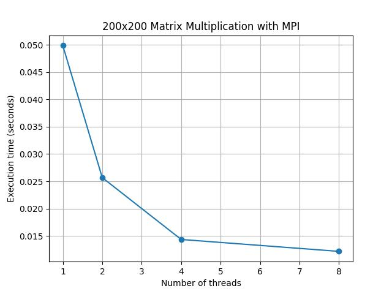
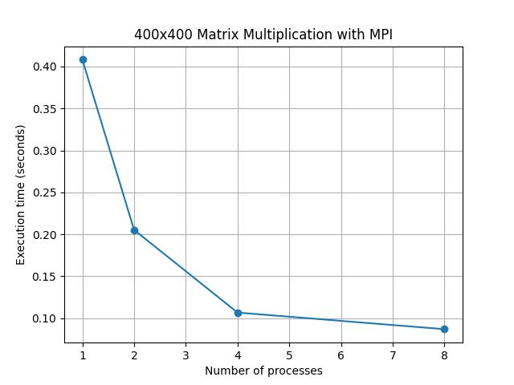
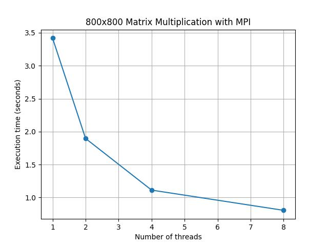
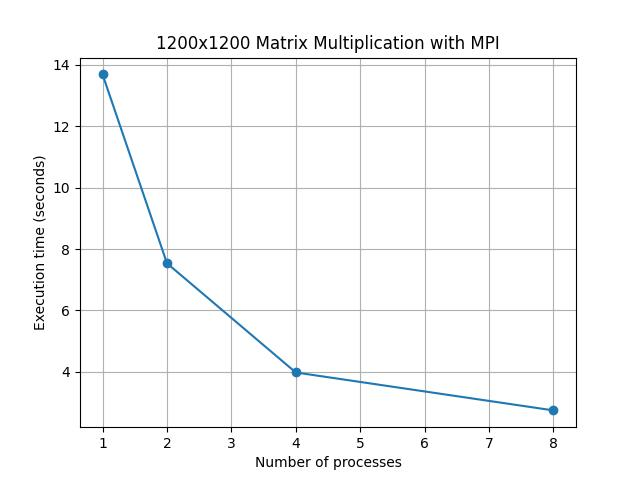
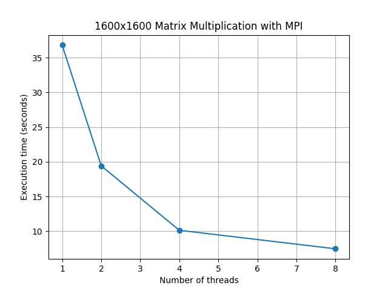
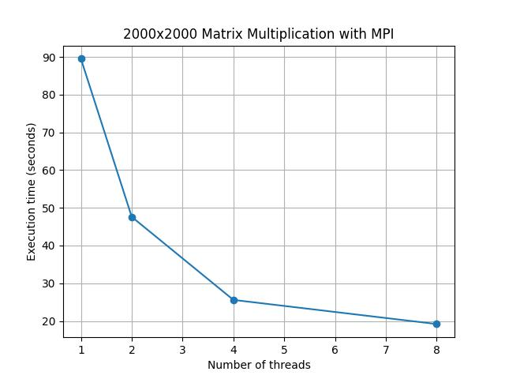

# Отчет по курсу  
## «Параллельное программирование»  
### Лабораторная работа №3

**Выполнил студент группы:**  
6212-100503D  
Зарипов Дамир Радикович  

**Преподаватель:**  
Минаев Евгений Юрьевич    

---

## Задание

Модифицировать программу из л/р №1 для параллельной работы по технологии MPI. 
Провести серию экспериментов с разными размерами матриц (примерно 200, 400, 800, 1200, 1600, 2000), с разным количеством вычислительных ядер (1, 2, 4, 8 и т.д.).

---

## Краткое описание решения задачи

Матрица результата разбивается по строкам между процессами.
Каждый процесс получает свою часть строк матрицы A.
Матрица B передаётся всем процессам через `MPI_Bcast`.
Локальные вычисления выполняются независимо на каждом процессе.
Каждый процесс вычисляет только свой фрагмент результата.
Затем части результата собираются на процессе с рангом 0.
Для этого используется операция `MPI_Gatherv`.
Такой подход уменьшает общее время вычислений за счёт параллельной обработки.

Матрицы генерируются и считываются из файлов:

- `matrixA.txt`
- `matrixB.txt`

Результаты работы программы записываются в файлы:

- `plot.txt` — данные для построения графиков
- `raw_result.txt` — данные результирующей матрицы для проверки
- `stats.txt` — статистика выполнения (размер матрицы, число процессов, время выполнения, объём вычислений, результат проверки корректности)

Измерение времени производится с помощью библиотеки **`std::chrono`**, что позволяет получить точные значения времени выполнения программы.

Корректность вычислений автоматически проверяется с помощью **Python** и библиотеки **NumPy**, где результат сравнивается с эталонным перемножением матриц.

---

## Результаты экспериментов

Путём нескольких запусков программы были получены **графики зависимости времени выполнения от количества процессов** для различных размеров матриц.

---

## Вывод

В работе реализовано параллельное умножение матриц с использованием технологии MPI. 
Распараллеливание выполнено по строкам результирующей матрицы, что позволило распределить вычислительную нагрузку между процессами. 
Эксперименты показали снижение времени выполнения при увеличении числа процессов. Наибольший эффект ускорения наблюдается при больших размерах матриц.

Полученные результаты демонстрируют эффективность применения **параллельных вычислений** для ускорения задач с высокой вычислительной сложностью.
