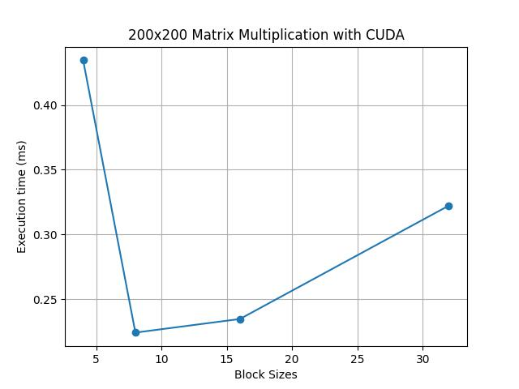
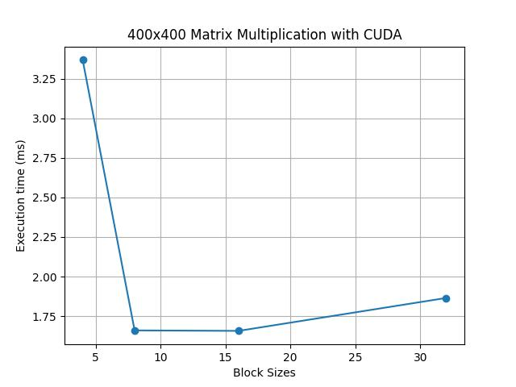
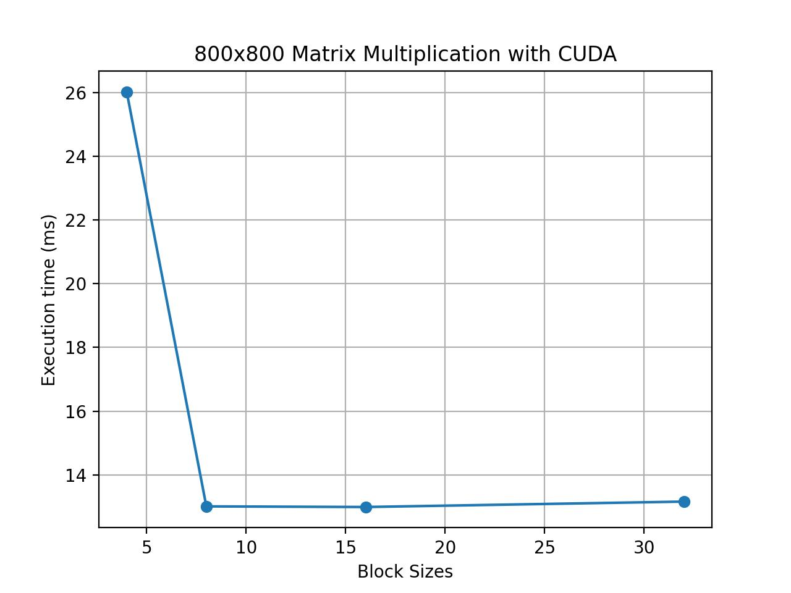
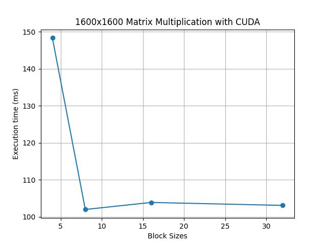
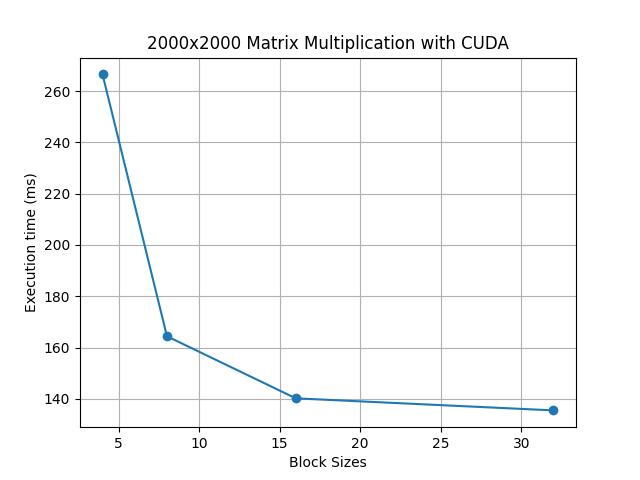
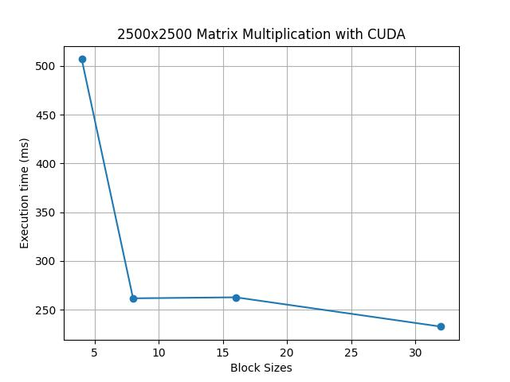
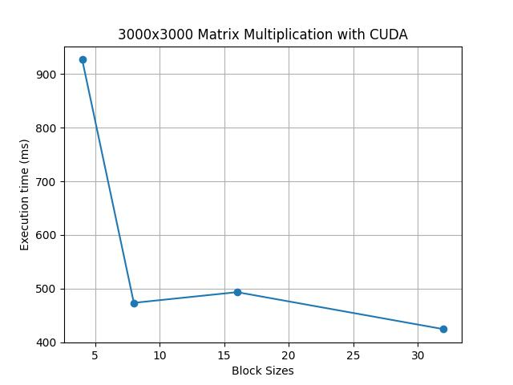

# Отчет по курсу  
## «Параллельное программирование»  
### Лабораторная работа №4

**Выполнил студент группы:**  
6212-100503D  
Зарипов Дамир Радикович  

**Преподаватель:**  
Минаев Евгений Юрьевич    

---

## Задание

Модифицировать программу из л/р №1 для параллельной работы по технологии *CUDA*. 
Провести эксперименты с разными размерами матриц и различными конфигурациями сетки блоков.

---

## Краткое описание решения задачи

Каждый поток CUDA вычисляет один элемент результирующей матрицы.  
Разбиение вычислений осуществляется по двумерной сетке блоков:

- блоки задаются через `dim3 blockSize(x, y)`
- сетка потоков вычисляется автоматически на основе размера матрицы

Основной вычислительный этап реализован в **CUDA kernel**:

- каждый поток получает индексы строки и столбца
- выполняет скалярное произведение строки A и столбца B
- записывает результат в матрицу C

Перед запуском измерений выполняется **warmup-запуск**, чтобы исключить накладные расходы инициализации CUDA.

Матрицы генерируются и считываются из файлов:

- `matrixA.txt`
- `matrixB.txt`

Результаты работы программы записываются в файлы:

- `plot.txt` — данные для построения графиков
- `raw_result.txt` — данные результирующей матрицы для проверки
- `stats.txt` — статистика выполнения (размер матрицы, число процессов, время выполнения, объём вычислений, результат проверки корректности)

Время выполнения замеряется с использованием библиотеки **`std::chrono`**. Измеряется только выполнение **CUDA kernel** после **warmup-запуска**.

Корректность вычислений автоматически проверяется с помощью **Python** и библиотеки **NumPy**, где результат сравнивается с эталонным перемножением матриц.

---

## Результаты экспериментов

Путём нескольких запусков программы были получены **графики зависимости времени выполнения от количества блоков** для различных размеров матриц. 
(более подробные данные в `stats.txt`)

Таблица (в миллисекундах).

| Блок \ Квадратная матрица | 200 | 400 | 500 | 800 | 1200 | 1600 | 2000 | 2500 | 3000 |
| :--- | :--- | :--- | :--- | :--- | :--- | :--- | :--- | :--- | :--- |
| **4×4** | 0.4345 | 3.368 | 6.477 | 26.02 | 72.41 | 148.3 | 266.5 | 506.9 | 926.6 |
| **8×8** | 0.2243 | 1.660 | 3.237 | 13.01 | 43.83 | 102.0 | 164.4 | 261.8 | 473.5 |
| **16×16** | 0.2348 | 1.657 | 3.277 | 12.99 | 43.66 | 103.9 | 140.2 | 262.8 | 493.4 |
| **32×32** | 0.3223 | 1.865 | 3.312 | 13.16 | 44.20 | 103.1 | 135.5 | 232.7 | 424.4 |

Графики:

---

## Анализ результатов

На малых размерах матриц влияние CUDA overhead заметно, поэтому время нестабильно.
При увеличении размеров матриц наблюдается рост вычислительной эффективности GPU.
Наивысшую производительность на средних размерах показал блок **32×32**, а для меньших размеров отлично подходит блок **16×16**.
Конфигурация 4×4 является наименее эффективной из-за низкой загрузки GPU.

---

## Вывод

В работе реализовано параллельное умножение матриц с использованием технологии **CUDA**.

Каждый элемент результирующей матрицы вычисляется отдельным потоком GPU, что позволяет значительно ускорить вычисления по сравнению с последовательной реализацией.

Проведённые эксперименты показали, что использование GPU позволяет существенно снизить время выполнения операции умножения матриц при больших размерах данных.
