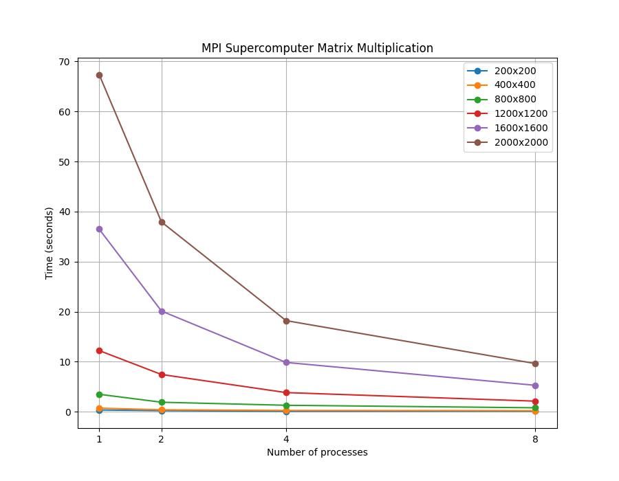

# Отчет по курсу  
## «Параллельное программирование»  
### Лабораторная работа №5

**Выполнил студент группы:**  
6212-100503D  
Зарипов Дамир Радикович  

**Преподаватель:**  
Минаев Евгений Юрьевич    

---

## Задание

Параллельную версию программы на **MPI** необходимо также запустить на суперкомпьютере **«Сергей Королёв»**.

---

## Краткое описание решения задачи

Реализовано параллельное умножение квадратных матриц с использованием библиотеки **MPI**.
В основе решения лежит разбиение результирующей матрицы по строкам между процессами.

На процессе с рангом 0 выполняется чтение исходных матриц из файлов `matrixA.txt` и `matrixB.txt`. Далее размер задачи передаётся всем процессам с помощью `MPI_Bcast`. Матрицы A и B распространяются между процессами, после чего каждый процесс вычисляет свою часть строк результирующей матрицы независимо от других.

Для равномерного распределения нагрузки используется схема с учётом остатка: если число строк не делится нацело на количество процессов, первые процессы получают на одну строку больше. Это позволяет избежать простоя вычислительных ресурсов.

После завершения локальных вычислений частичные результаты собираются на процессе с рангом 0 с помощью `MPI_Gatherv`, что обеспечивает корректную сборку результирующей матрицы.

Измерение времени выполнения производится с использованием `std::chrono`.
Результаты работы сохраняются в файлы `plot.txt` и `stats.txt`, а корректность вычислений проверяется с помощью Python-скрипта на основе библиотеки `NumPy`.

---

## Результаты экспериментов

В результате запусков программы на суперкомпьютере были получены данные для построения **графика зависимости времени от количества процессов** для различных размеров матриц. 
(более подробные данные в `stats.txt`)

Таблица результатов (в секундах).

| Размер матриц \ Количество процессов | 1 | 2 | 4 | 8 |
|:--------------:|----------:|-----------:|-----------:|------------:|
| **200 × 200**  | 0.345912  | 0.2147     | 0.089541   | 0.102334    |
| **400 × 400**  | 0.712648  | 0.38192    | 0.247118   | 0.201556    |
| **800 × 800**  | 3.48291   | 1.89234    | 1.28477    | 0.781552    |
| **1200 × 1200**| 12.214    | 7.43862    | 3.82157    | 2.10948     |
| **1600 × 1600**| 36.4875   | 20.118     | 9.84271    | 5.2763      |
| **2000 × 2000**| 67.3821   | 37.915     | 18.2043    | 9.6217      |

График:

---

## Вывод

Экспериментальные результаты показали, что увеличение числа процессов приводит к уменьшению времени выполнения программы. При этом наиболее заметное ускорение достигается для матриц больших размеров, где вычислительная нагрузка значительно превышает накладные расходы на передачу данных.

Для небольших размеров матриц эффективность параллелизации ниже, что связано с влиянием коммуникационных затрат и ограничений пропускной способности памяти. Кроме того, при увеличении числа процессов наблюдается снижение эффективности масштабирования, что объясняется дополнительными издержками на синхронизацию и обмен данными.
